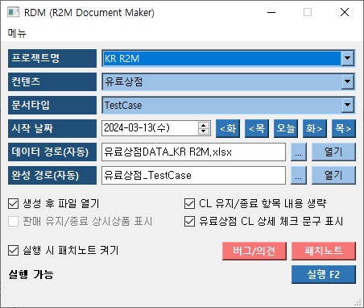

## 유료상점/이벤트 테스트 케이스 자동화 툴 프로젝트 (R2M 전용)



### 목차

1. [**소개**](#1-소개)
2. [**설치**](#2-설치)
3. [**사용법**](#3-사용법)
4. [**기능**](#4-기능)

---

### 1. 소개

1. **패턴화 가능한 컨텐츠 선정 및 TC/CL 자동화 개발**

    ```bash
    특정 컨텐츠의 명세서 기반 TC/CL 자동화 설계
    사용 편의성을 위한 GUI 개발
    ```

2. **기획 문서 통합 관리 및 연동**

    ```bash
    Sharepoint를 활용하여 기획 문서를 팀 내 1개로 관리
    별도의 추가 작업없이 기획 문서를 TC/CL로 변환 기능 개발

    ```

---

### 2. 설치

1. **공통**:

    ```bash
    # 프로젝트 클론
    git clone https://github.com/SungMinseok/TC_AutoMaker-R2M
    ```
    
    ```bash
    # 가상환경 생성 (python == 3.9.4)
    python -m venv RDM
    ```
2. **외부망**:
    ```bash
    # 의존성 설치
    cd RDM
    pip install -r requirements.txt
    ```
<!--     
3. **내부망**:
    ```bash
    # 의존성 다운로드 (외부망)
    cd RDM
    pip download -d pkg -r requirements.txt

    # 가상환경 생성 (내부망)
    d:\venv>python -m venv RDM
    d:\venv>cd RDM
    d:\venv\RDM>Scripts\activate.bat
    
    # 의존성 설치 (내부망)
    (r2a) d:\venv\RDM>pip install --no-index --find-links=d:\pkg -r d:\RDM\requirements.txt
    ``` -->

---

### 3. 사용법
<!-- 
1. **개발PC**:

    ```bash
    python Execute.py
    ``` -->

1. **원본PC**:

    ```bash
    python RDM.py
    ```

---

### 4. 기능

1. **GUI 개발로 사용 편의성 향상**:

    ```bash
    GUI 연동을 통해 가독성 및 사용성 향상
    ```

2. **Sharepoint 내 문서 연동 기능 탑재**:

    ```bash
    명세서 연동 및 히스토리 관리(엑셀 파일 형태)
    ```
    
3. **원하는 데이터 선별하여 원하는 타입의 문서 생성**:

    ```bash
    정기점검-유료상점
    정기점검-이벤트
    업데이트-유료상점
    업데이트-이벤트
    ```
    
